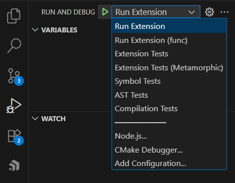

# Contributing to the extension

If you wish to contribute to the extension, please read this guide to understand the processes and standards we use.

## Registering formatter issues

If you want to register an issue, use [Formatter bug template](https://github.com/BalticAmadeus/AblFormatter/issues/new/choose).

## How to contribute

1. Fork this repository.
2. Visit the Issues tab, and find an issue or bug you'd like to work on.
3. Create a new branch for your bug fix or new feature.
4. Commit your changes and push them to your branch on GitHub.
5. Submit a pull request (PR) to the main repository.

The following sections provide more detailed technical information and standard practices used in this project.

## Using the existing .wasm file for the extension

The current .wasm file is included in the `resources` folder.

If your changes require reinstalling the extension, follow these steps:

1. In the terminal, run: `npm run package`.
2. A .vsix file should be generated.
3. Install the extension from this file.

## Using a new .wasm file for the extension

If you need to fix a parser bug or modify the tree-sitter parser:

1. Make sure Python is installed on your computer.
2. Tree-sitter-abl (https://github.com/eglekaz/tree-sitter-abl) is the parser that we use for the formatter, so clone it.
3. In the parser directory, run: `node-gyp configure`.
4. Install emcc (https://github.com/emscripten-core/emsdk.git), add it to your `PATH`, and verify the installation.

For more details, see the tree-sitter documentation or the tree-sitter-abl repository.

After making changes to the parser:

1. Run `npm run test` (only continue if the tests pass).
2. Run `npm run build:wasm` (this will build the .wasm file in the tree-sitter repo).
3. Move the new .wasm file to the `resources` folder in your formatter branch.
4. Refer to the instructions in the [Using the Existing .wasm File for the Extension](#using-the-existing-wasm-file-for-the-extension) section to finish installation.

> **Note:**  
> For contributions to the tree-sitter-abl repository, follow the standard GitHub fork-and-PR workflow:
>
> 1. Create a new branch in tree-sitter-abl.
> 2. Commit your changes and push them.
> 3. Submit a pull request.

## Development practices

When contributing, please follow these conventions:

1. Variable and folder names are written in English and use Camel Case (Multiple words are joined together without spaces or underscores, and each word's first letter is capitalized except for the first word).
2. File names can be written in Camel and Pascal Case.
3. For functional test file names, use the test order number and a short description (e.g., 4assign-array-literal). If multiple tests are needed for a specific case, append a unique number (e.g., 4assign-array-literal3).
4. If you are implementing a new feature, write functional tests that cover both typical usage and relevant edge cases. Ensure your tests follow the standard ABL coding conventions (https://conf.baltic-amadeus.lt/pages/viewpage.action?pageId=20423083).
5. Ensure all tests (functionality, symbol, AST) pass in your GitHub PR pipeline.
6. In classes, methods should be indented by four spaces.

## Running the tests

All test suites are automatically run when you create a pull request (PR). To run the tests locally in Visual Studio Code:

1. Click on the Run and Debug icon in the left sidebar (or press Ctrl+Shift+D).
2. In the dropdown menu, select the test suite you want to run.
3. Click the green Start button (▶) or press F5 to start the test chosen tests.
4. See whether the tests pass or not live in the Debug console.

## Additional notes regarding development

1. For information on debugging and formatter configuration, see the [README.md](README.md) in this repository.
2. Formatters for ABL syntax structures are in `src/formatters`. Files for node tree iteration and formatter application are in `src/formatterFramework`.
3. If any tests fail, you can view the detailed results in the `resources/testResults` directory.
