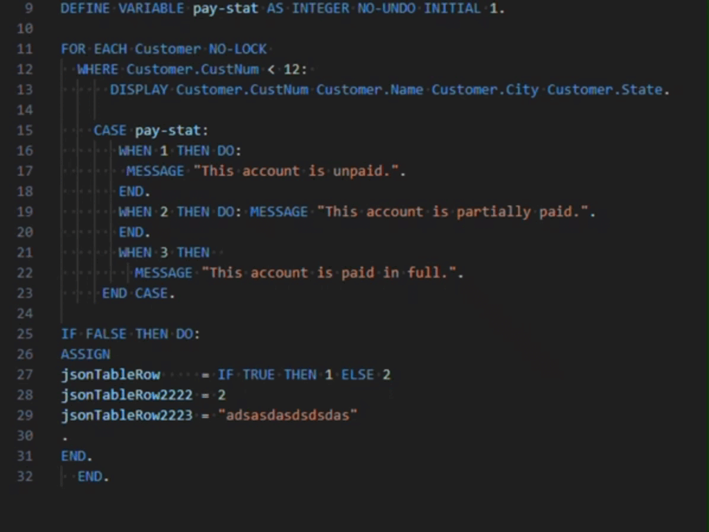

#  OpenEdge ABL Formatter 

VSCode extension for Progress OpenEdge code formatting.

This extension uses [**tree-sitter-abl**](https://github.com/usagi-coffee/tree-sitter-abl) implementation by Kamil Jakubus.

## Current status

This is an early preview. Currently, the formatter is not ready for the public release. You can only download it here and install from **vsix** file.

**Planned release date: 2025-01**

TODO: Add gif here

## Features

At the moment we implemented formatting logic for these language features:

- Assign
- block
- body
- case
- define
- enum
- find
- for
- functionParameter
- if
- ifFunction
- procedureParameter
- property
- tempTable
- using
- variableDefinition

## Configuration

We implemented extensive settings configuration to allow users to easly tailor the experience to their needs. This might not be the case in the future.

### Settings 

### Formatting on save

TODO: link a separate file with settings

## Installation

Download the extension **vsix** file from GitHub repository and install it on your machine.

[How to install from **vsix**?](https://code.visualstudio.com/docs/editor/extension-marketplace#_install-from-a-vsix)

## Usage

Alowed file extensions:

- **.p**
- **.cls**
- **.i**
- **.w**

Commands:

- **Format Document**: Formats the entire ABL document.
- **Format Selection**: Formats only the selected lines of code.

## Debuging

- TODO: describe how to deal with debug mode

## Contributing

### Registering formatter issues

- TODO: create issue template

### Fixing yourself

1. Fork the repository.
2. Create a new branch for your feature or bug fix.
3. Commit your changes and push to your branch.
4. Submit a pull request to the main repository.

## License

This project is licensed under the APACHE 2.0 License - see the LICENSE file for details.
